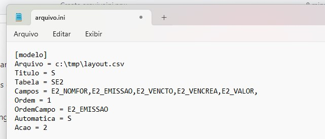

## Description
Trabalhando com arquivos INI no Protheus

No Protheus, é simples de usar, podemos usar a função GetPvProfString() para ler o arquivo e buscar a seção, chaves e valores.

Sintaxe: GetPvProfString( < cSecao >, < cChave >, < cPadrao >, < cNomeArqCfg >, [ uParam5 ], [ uParam6 ] )

## Exemplo

Youtube: <a href="https://youtu.be/3OyuOH2Pg3I" target="_blank">Veja este exemplo</a>

